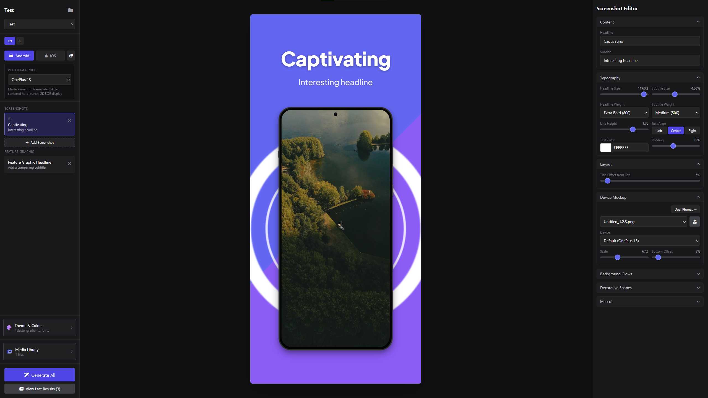

# App Store Screenshot Generator


Generate App Store and Google Play marketing screenshots with a visual editor
and a shared render pipeline for preview and export.



## What It Does

- Visual editor with live preview
- iOS and Android output support
- Multi-language project setup
- Shared renderer for browser preview and PNG export
- Project-based asset and config management

> [!NOTE]
> This project started as a script-first screenshot generator. Later on a
> generated frontend was attached to it. The frontend has been iteratively
> refined over time, and the history is documented in
> [docs/PROJECT_HISTORY.md](docs/PROJECT_HISTORY.md).

## Quick Start

### Prerequisites

- Deno 2.x
- Node.js 20+
- Google Chrome or Chromium (for PNG export)

### Run locally

```bash
git clone https://github.com/HarmenSchouten/appstore-screenshot-generator.git
cd appstore-screenshot-generator
npm ci
deno task dev
```

Open http://localhost:5173

## Day-to-day Commands

```bash
# Start API + Vite UI
deno task dev

# Verify before a PR
npm run verify
```

## Output and Projects

- Project data: projects/{project-id}/
- Generated images: projects/{project-id}/output/{language}/{platform}/
- Root output mode: output/

## Architecture at a Glance

- API and orchestration: src/server.ts and src/routes/
- Screenshot generation: src/generate.ts and src/convert.ts
- Shared renderer components: src/renderer-components/
- Editor UI: src/ui/ (React + Vite)

For project evolution and technical decisions, see:

- [docs/README.md](docs/README.md)
- [docs/PROJECT_HISTORY.md](docs/PROJECT_HISTORY.md)

## Contributing

See [CONTRIBUTING.md](CONTRIBUTING.md) for setup, verification steps, and PR
expectations.

## Troubleshooting

### Chrome not found

Set PUPPETEER_EXECUTABLE_PATH if Chrome is not auto-detected.

Windows PowerShell:

```powershell
$env:PUPPETEER_EXECUTABLE_PATH="C:\Path\To\chrome.exe"
```

macOS/Linux:

```bash
export PUPPETEER_EXECUTABLE_PATH="/path/to/chrome"
```

### Fonts not loading

Generation needs network access for Google Fonts URLs in project theme settings.

## License

MIT
